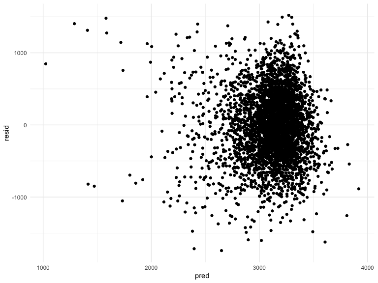

p8105\_hw6\_md3851
================
Misbath Daouda
11/19/2019

Problem 1
=========

``` r
bwt_data = read_csv("./data/birthweight.csv") %>% 
  janitor::clean_names() %>%
  mutate( 
    babysex = as.factor(babysex),
    frace = as.factor(frace),
    malform = as.factor(malform), 
    mrace = as.factor(mrace),
    ) %>%
  drop_na() %>%
  view()
```

    ## Parsed with column specification:
    ## cols(
    ##   .default = col_double()
    ## )

    ## See spec(...) for full column specifications.

``` r
model_1 = lm(bwt ~ mrace + momage + smoken + mrace*momage + mrace*smoken + momage*smoken, data = bwt_data)

bwt_data %>% 
  add_residuals(model_1) %>%
  add_predictions(model_1) %>% 
  ggplot(aes(x = pred, y = resid)) + 
  geom_point()
```



``` r
model_2 = lm(bwt ~ blength + gaweeks, data = bwt_data)

model_3 = lm(bwt ~ bhead + blength + babysex +  bhead*blength + bhead*babysex + blength*babysex + bhead*blength*babysex, data = bwt_data)

#Cross validation  

cv_df = 
  crossv_mc(bwt_data, 100)

cv_df = cv_df %>% 
  mutate(model_1  = map(train, ~lm(bwt ~ mrace + momage + smoken + mrace*momage + 
         mrace*smoken + momage*smoken, data = .x)),
         model_2  = map(train, ~lm(bwt ~ blength + gaweeks, data = .x)),
         model_3  = map(train, ~lm(bwt ~ blength + gaweeks, data = bwt_data))) %>% 
  mutate(rmse_1 = map2_dbl(model_1, test, ~rmse(model = .x, data = .y)),
         rmse_2 = map2_dbl(model_2, test, ~rmse(model = .x, data = .y)),
         rmse_3 = map2_dbl(model_3, test, ~rmse(model = .x, data = .y)))

cv_plot = cv_df %>% 
  select(starts_with("rmse")) %>% 
pivot_longer(
    everything(),
    names_to = "model", 
    values_to = "rmse",
    names_prefix = "rmse_") %>% 
  mutate(model = fct_inorder(model)) %>% 
  ggplot(aes(x = model, y = rmse)) + geom_violin()

cv_plot 
```


Problem 2
=========
