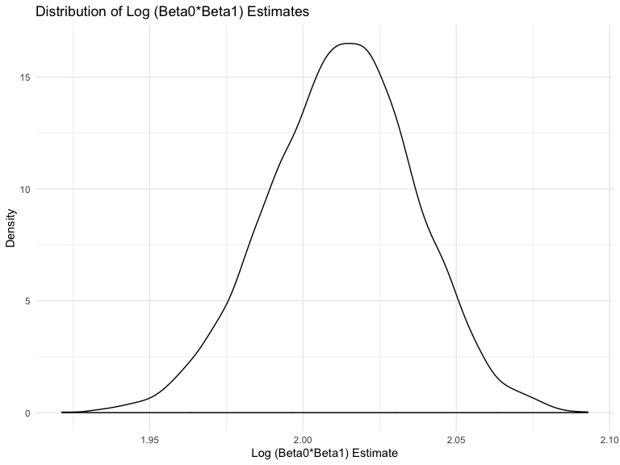
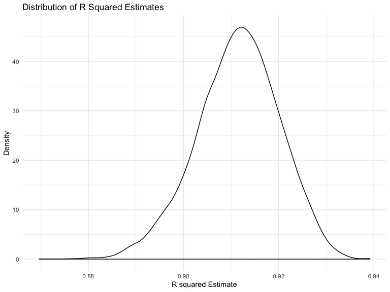

p8105\_hw6\_md3851
================
Misbath Daouda
11/19/2019

Problem 1
=========

### Model Selection

``` r
bwt_data = read_csv("./data/birthweight.csv") %>% 
  janitor::clean_names() %>%
  mutate( 
    babysex = as.factor(babysex),
    babysex = recode(babysex, "1" = "male", "2" = "female"),
    frace = as.factor(frace),
    frace = recode(frace, "1" = "white", "2" = "black", "3" = "asian", "4" = "puerto rican", "8" = "other", "9" = "unkown"),
    malform = as.factor(malform),
    malform = recode(malform, "0" = "absent", "1" = "present"),
    mrace = as.factor(mrace),
    mrace = recode(mrace, "1" = "white", "2" = "black", "3" = "asian", "4" = "puerto rican", "8" = "other")
    ) %>%
  drop_na() 
```

    ## Parsed with column specification:
    ## cols(
    ##   .default = col_double()
    ## )

    ## See spec(...) for full column specifications.

``` r
bwt_data
```

    ## # A tibble: 4,342 x 20
    ##    babysex bhead blength   bwt delwt fincome frace gaweeks malform menarche
    ##    <fct>   <dbl>   <dbl> <dbl> <dbl>   <dbl> <fct>   <dbl> <fct>      <dbl>
    ##  1 female     34      51  3629   177      35 white    39.9 absent        13
    ##  2 male       34      48  3062   156      65 black    25.9 absent        14
    ##  3 female     36      50  3345   148      85 white    39.9 absent        12
    ##  4 male       34      52  3062   157      55 white    40   absent        14
    ##  5 female     34      52  3374   156       5 white    41.6 absent        13
    ##  6 male       33      52  3374   129      55 white    40.7 absent        12
    ##  7 female     33      46  2523   126      96 black    40.3 absent        14
    ##  8 female     33      49  2778   140       5 white    37.4 absent        12
    ##  9 male       36      52  3515   146      85 white    40.3 absent        11
    ## 10 male       33      50  3459   169      75 black    40.7 absent        12
    ## # … with 4,332 more rows, and 10 more variables: mheight <dbl>,
    ## #   momage <dbl>, mrace <fct>, parity <dbl>, pnumlbw <dbl>, pnumsga <dbl>,
    ## #   ppbmi <dbl>, ppwt <dbl>, smoken <dbl>, wtgain <dbl>

``` r
model_selection = lm(bwt ~., data = bwt_data) %>% 
  MASS::stepAIC(direction = "both", trace = FALSE) %>% 
  summary()

model_selection
```

    ## 
    ## Call:
    ## lm(formula = bwt ~ babysex + bhead + blength + delwt + fincome + 
    ##     gaweeks + mheight + mrace + parity + ppwt + smoken, data = bwt_data)
    ## 
    ## Residuals:
    ##      Min       1Q   Median       3Q      Max 
    ## -1097.18  -185.52    -3.39   174.14  2353.44 
    ## 
    ## Coefficients:
    ##                     Estimate Std. Error t value Pr(>|t|)    
    ## (Intercept)       -6098.8219   137.5463 -44.340  < 2e-16 ***
    ## babysexfemale        28.5580     8.4549   3.378 0.000737 ***
    ## bhead               130.7770     3.4466  37.944  < 2e-16 ***
    ## blength              74.9471     2.0190  37.120  < 2e-16 ***
    ## delwt                 4.1067     0.3921  10.475  < 2e-16 ***
    ## fincome               0.3180     0.1747   1.820 0.068844 .  
    ## gaweeks              11.5925     1.4621   7.929 2.79e-15 ***
    ## mheight               6.5940     1.7849   3.694 0.000223 ***
    ## mraceblack         -138.7925     9.9071 -14.009  < 2e-16 ***
    ## mraceasian          -74.8868    42.3146  -1.770 0.076837 .  
    ## mracepuerto rican  -100.6781    19.3247  -5.210 1.98e-07 ***
    ## parity               96.3047    40.3362   2.388 0.017004 *  
    ## ppwt                 -2.6756     0.4274  -6.261 4.20e-10 ***
    ## smoken               -4.8434     0.5856  -8.271  < 2e-16 ***
    ## ---
    ## Signif. codes:  0 '***' 0.001 '**' 0.01 '*' 0.05 '.' 0.1 ' ' 1
    ## 
    ## Residual standard error: 272.3 on 4328 degrees of freedom
    ## Multiple R-squared:  0.7181, Adjusted R-squared:  0.7173 
    ## F-statistic: 848.1 on 13 and 4328 DF,  p-value: < 2.2e-16

Model selection was automated with the stepAIC function from the MASS package. The direction was set to "both" so that both forward and backward selection were completed. The results return the best model, which is then labeled as model\_1 below.

### Residual Plots

``` r
model_1 = lm(bwt ~ babysex + bhead + blength + delwt + fincome + 
    gaweeks + mheight + mrace + parity + ppwt + smoken, data = bwt_data)

bwt_data %>% 
  add_residuals(model_1) %>%
  add_predictions(model_1) %>% 
  ggplot(aes(x = pred, y = resid)) + 
  geom_point() + 
  labs(
       title = "Model_1 Residual Plot", 
       x = "Predictions",
       y = "Standardized Residuals")
```


``` r
model_2 = lm(bwt ~ blength + gaweeks, data = bwt_data)

bwt_data %>% 
  add_residuals(model_2) %>%
  add_predictions(model_2) %>% 
  ggplot(aes(x = pred, y = resid)) + 
  geom_point() + 
  labs(
       title = "Model_2 Residual Plot", 
       x = "Predictions",
       y = "Standardized Residuals")
```


``` r
model_3 = lm(bwt ~ bhead + blength + babysex +  bhead*blength + bhead*babysex + blength*babysex + bhead*blength*babysex, data = bwt_data)

bwt_data %>% 
  add_residuals(model_3) %>%
  add_predictions(model_3) %>% 
  ggplot(aes(x = pred, y = resid)) + 
  geom_point() +
  labs(
       title = "Model_3 Residual Plot", 
       x = "Predictions",
       y = "Standardized Residuals")
```


The three models and their associated residual plots are presented above.

### Cross validation

``` r
cv_df = 
  crossv_mc(bwt_data, 100)

cv_df = cv_df %>% 
  mutate(model_1  = map(train, ~lm(bwt ~ babysex + bhead + blength + delwt + fincome + 
    gaweeks + mheight + mrace + parity + ppwt + smoken, data = .x)),
         model_2  = map(train, ~lm(bwt ~ blength + gaweeks, data = .x)),
         model_3  = map(train, ~lm(bwt ~ bhead + blength + babysex +  bhead*blength + bhead*babysex + blength*babysex + bhead*blength*babysex, data = .x))) %>% 
  mutate(rmse_1 = map2_dbl(model_1, test, ~rmse(model = .x, data = .y)),
         rmse_2 = map2_dbl(model_2, test, ~rmse(model = .x, data = .y)),
         rmse_3 = map2_dbl(model_3, test, ~rmse(model = .x, data = .y)))

cv_plot = cv_df %>% 
  select(starts_with("rmse"))%>% 
  pivot_longer(
    everything(),
    names_to = "model", 
    values_to = "rmse",
    names_prefix = "rmse_") %>% 
  mutate(model = fct_inorder(model)) %>% 
  ggplot(aes(x = model, y = rmse)) + geom_violin()

cv_plot 
```


The cross-validation plot above shows the distribution of RMSE values for each candidate model. The RMSE is the square root of the variance of the residuals. It indicates the absolute fit of the model to the data or how close the observed data points are to the model’s predicted values. Given that model\_1 has the lowest RMSE values, this suggests that it performs better than the two other models. Similarly, model\_2 performs better than model\_3.

Problem 2
=========

### Creating bootstraps samples

``` r
weather_df = 
  rnoaa::meteo_pull_monitors(
    c("USW00094728"),
    var = c("PRCP", "TMIN", "TMAX"), 
    date_min = "2017-01-01",
    date_max = "2017-12-31") %>%
  mutate(
    name = recode(id, USW00094728 = "CentralPark_NY"),
    tmin = tmin / 10,
    tmax = tmax / 10) %>%
  select(name, id, everything())

boot_straps_tidy = weather_df %>% 
  bootstrap(n=5000) %>% 
  mutate(models = map(strap, ~lm(tmax ~ tmin, data = .x)),
         results = map(models, broom::tidy)) %>% 
  select(-strap, -models) %>% 
  unnest(results) %>% 
  select(-std.error, -statistic, -p.value) %>%
  pivot_wider(
    names_from = term,
    values_from = estimate
  ) %>% 
  rename(beta1 = tmin, beta0 = `(Intercept)`) %>% 
  mutate(log = log(beta0*beta1))

boot_straps_tidy
```

    ## # A tibble: 5,000 x 4
    ##    .id   beta0 beta1   log
    ##    <chr> <dbl> <dbl> <dbl>
    ##  1 0001   7.28  1.04  2.03
    ##  2 0002   7.19  1.03  2.01
    ##  3 0003   7.34  1.04  2.03
    ##  4 0004   7.01  1.06  2.00
    ##  5 0005   7.31  1.02  2.01
    ##  6 0006   6.89  1.06  1.99
    ##  7 0007   7.10  1.04  2.00
    ##  8 0008   7.21  1.04  2.02
    ##  9 0009   7.11  1.04  2.00
    ## 10 0010   7.25  1.04  2.02
    ## # … with 4,990 more rows

``` r
boot_straps_glance = weather_df %>% 
  bootstrap(n=5000) %>% 
  mutate(models = map(strap, ~lm(tmax ~ tmin, data = .x) ),
         results = map(models, broom::glance)) %>% 
  select(-strap, -models) %>% 
  unnest(results) %>% 
  select(.id, r.squared)

boot_straps_glance
```

    ## # A tibble: 5,000 x 2
    ##    .id   r.squared
    ##    <chr>     <dbl>
    ##  1 0001      0.893
    ##  2 0002      0.912
    ##  3 0003      0.917
    ##  4 0004      0.901
    ##  5 0005      0.920
    ##  6 0006      0.923
    ##  7 0007      0.904
    ##  8 0008      0.901
    ##  9 0009      0.906
    ## 10 0010      0.908
    ## # … with 4,990 more rows

### Visualizing distribution of estimates

``` r
log_plot = boot_straps_tidy %>% 
  ggplot(aes(x = log)) +
    geom_density() + 
    labs(
    x = "Log (Beta0*Beta1) Estimate",
    y = "Density",
    title = "Distribution of Log (Beta0*Beta1) Estimates")

log_plot
```



The estimates for the log value follow an approximately normal distribution, except for a small divot at the very top of the peak. There is also a larger tail towards the lower values than higher values which could indicate that large outliers are excluded from the bootstrap more than smaller outliers.

``` r
r_sq_plot = boot_straps_glance %>% 
  ggplot(aes(x = r.squared)) +
    geom_density() + 
    labs(
    x = "R squared Estimate",
    y = "Density",
    title = "Distribution of R Squared Estimates"
    )
r_sq_plot 
```



The estimates for the r squared value also follow a distribution close to normal, with a larger tail towards the lower values than higher values. This could indicate that large outliers are excluded from the bootstrap more than smaller outliers.

### Determining 95% CI

``` r
CI_rsquared = 
  boot_straps_glance %>% 
    summarize(
    perc_2.5 = round(quantile(r.squared, 0.025),2),
    perc_97.5 = round(quantile(r.squared, 0.975),2)) %>%
  knitr::kable()

CI_rsquared
```

|  perc\_2.5|  perc\_97.5|
|----------:|-----------:|
|       0.89|        0.93|

``` r
CI_log = 
  boot_straps_tidy %>% 
    summarize(
    perc_2.5 = round(quantile(log, 0.025),2),
    perc_97.5 = round(quantile(log, 0.975),2)) %>%
  knitr::kable()

CI_log
```

|  perc\_2.5|  perc\_97.5|
|----------:|-----------:|
|       1.96|        2.06|

The 95% CI for the log estimates ranges from 1.96-2.05.

The 95% CI for the rsquared estimates ranges from 0.89-0.93.
