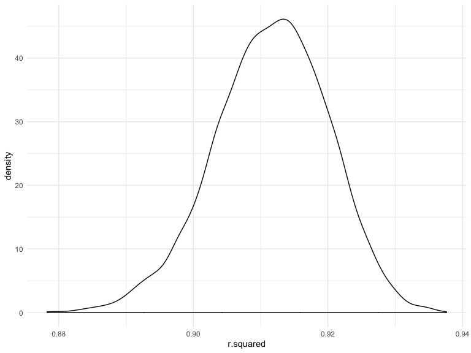

p8105\_hw6\_md3851
================
Misbath Daouda
11/19/2019

Problem 1
=========

``` r
bwt_data = read_csv("./data/birthweight.csv") %>% 
  janitor::clean_names() %>%
  mutate( 
    babysex = as.factor(babysex),
    frace = as.factor(frace),
    malform = as.factor(malform), 
    mrace = as.factor(mrace),
    ) %>%
  drop_na() %>%
  view()
```

    ## Parsed with column specification:
    ## cols(
    ##   .default = col_double()
    ## )

    ## See spec(...) for full column specifications.

``` r
model_1 = lm(bwt ~ gaweeks + wtgain + gaweeks*wtgain, data = bwt_data)

bwt_data %>% 
  add_residuals(model_1) %>%
  add_predictions(model_1) %>% 
  ggplot(aes(x = pred, y = resid)) + 
  geom_point()
```


``` r
model_2 = lm(bwt ~ blength + gaweeks, data = bwt_data)

model_3 = lm(bwt ~ bhead + blength + babysex +  bhead*blength + bhead*babysex + blength*babysex + bhead*blength*babysex, data = bwt_data)

#Cross validation  

cv_df = 
  crossv_mc(bwt_data, 100)

cv_df = cv_df %>% 
  mutate(model_1  = map(train, ~lm(bwt ~ gaweeks + wtgain + gaweeks*wtgain, data = .x)),
         model_2  = map(train, ~lm(bwt ~ blength + gaweeks, data = .x)),
         model_3  = map(train, ~lm(bwt ~ bhead + blength + babysex +  bhead*blength + bhead*babysex + blength*babysex + bhead*blength*babysex, data = .x))) %>% 
  mutate(rmse_1 = map2_dbl(model_1, test, ~rmse(model = .x, data = .y)),
         rmse_2 = map2_dbl(model_2, test, ~rmse(model = .x, data = .y)),
         rmse_3 = map2_dbl(model_3, test, ~rmse(model = .x, data = .y)))

cv_plot = cv_df %>% 
  select(starts_with("rmse")) %>% 
pivot_longer(
    everything(),
    names_to = "model", 
    values_to = "rmse",
    names_prefix = "rmse_") %>% 
  mutate(model = fct_inorder(model)) %>% 
  ggplot(aes(x = model, y = rmse)) + geom_violin()

cv_plot 
```


Problem 2
=========

``` r
weather_df = 
  rnoaa::meteo_pull_monitors(
    c("USW00094728"),
    var = c("PRCP", "TMIN", "TMAX"), 
    date_min = "2017-01-01",
    date_max = "2017-12-31") %>%
  mutate(
    name = recode(id, USW00094728 = "CentralPark_NY"),
    tmin = tmin / 10,
    tmax = tmax / 10) %>%
  select(name, id, everything())
```

    ## Registered S3 method overwritten by 'crul':
    ##   method                 from
    ##   as.character.form_file httr

    ## Registered S3 method overwritten by 'hoardr':
    ##   method           from
    ##   print.cache_info httr

    ## file path:          /Users/misbath/Library/Caches/rnoaa/ghcnd/USW00094728.dly

    ## file last updated:  2019-09-26 10:25:42

    ## file min/max dates: 1869-01-01 / 2019-09-30

``` r
boot_straps_tidy = weather_df %>% 
  bootstrap(n=5000) %>% 
  mutate(models = map(strap, ~lm(tmax ~ tmin, data = .x)),
         results = map(models, broom::tidy)) %>% 
  select(-strap, -models) %>% 
  unnest(results) %>% 
  select(-std.error, -statistic, -p.value) %>%
  pivot_wider(
    names_from = term,
    values_from = estimate
  ) %>% 
  rename(beta1 = tmin, beta0 = `(Intercept)`) %>% 
  mutate(log = log(beta0*beta1))

boot_straps_tidy
```

    ## # A tibble: 5,000 x 4
    ##    .id   beta0 beta1   log
    ##    <chr> <dbl> <dbl> <dbl>
    ##  1 0001   7.12  1.03  2.00
    ##  2 0002   7.12  1.03  1.99
    ##  3 0003   7.60  1.01  2.04
    ##  4 0004   7.40  1.03  2.03
    ##  5 0005   7.17  1.06  2.03
    ##  6 0006   7.31  1.05  2.04
    ##  7 0007   7.10  1.04  2.00
    ##  8 0008   6.65  1.08  1.97
    ##  9 0009   7.18  1.05  2.02
    ## 10 0010   7.02  1.06  2.01
    ## # … with 4,990 more rows

``` r
boot_straps_glance = weather_df %>% 
  bootstrap(n=5000) %>% 
  mutate(models = map(strap, ~lm(tmax ~ tmin, data = .x) ),
         results = map(models, broom::glance)) %>% 
  select(-strap, -models) %>% 
  unnest(results) %>% 
  select(.id, r.squared)

boot_straps_glance
```

    ## # A tibble: 5,000 x 2
    ##    .id   r.squared
    ##    <chr>     <dbl>
    ##  1 0001      0.898
    ##  2 0002      0.914
    ##  3 0003      0.914
    ##  4 0004      0.921
    ##  5 0005      0.910
    ##  6 0006      0.902
    ##  7 0007      0.925
    ##  8 0008      0.920
    ##  9 0009      0.901
    ## 10 0010      0.922
    ## # … with 4,990 more rows

``` r
log_plot = boot_straps_tidy %>% 
  ggplot(aes(x = log)) +
         geom_density()
log_plot
```


``` r
r_sq_plot = boot_straps_glance %>% 
  ggplot(aes(x = r.squared)) +
         geom_density()
r_sq_plot 
```



``` r
quantile(pull(boot_straps_tidy, log), probs =c(0.025, 0.975))
```

    ##     2.5%    97.5% 
    ## 1.966835 2.058417

``` r
quantile(pull(boot_straps_glance, r.squared), probs =c(0.025, 0.975))
```

    ##      2.5%     97.5% 
    ## 0.8935228 0.9269732
